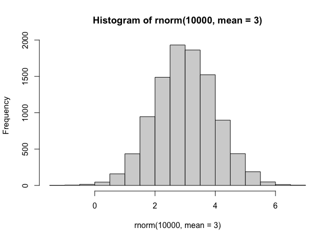
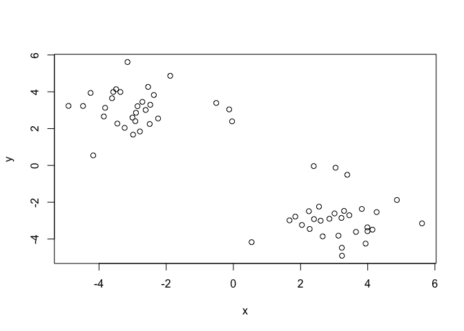
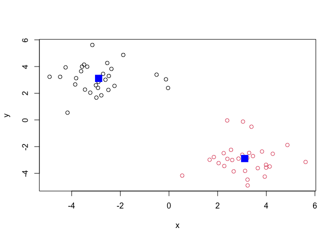
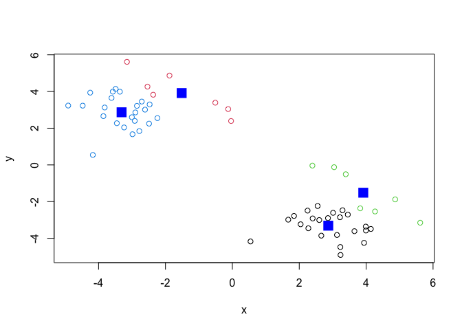
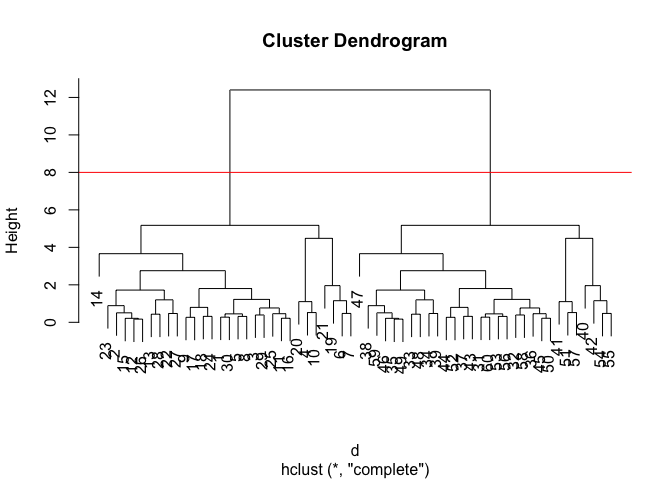
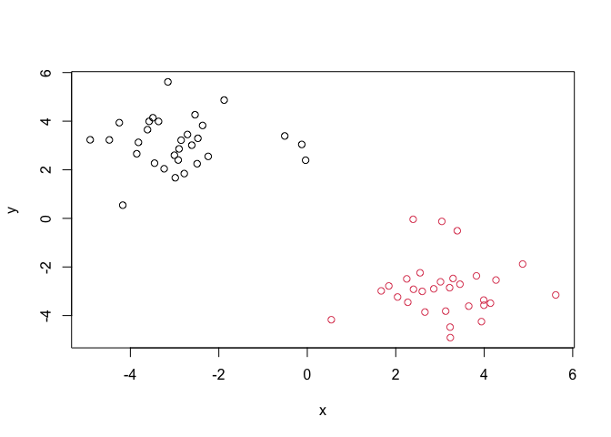
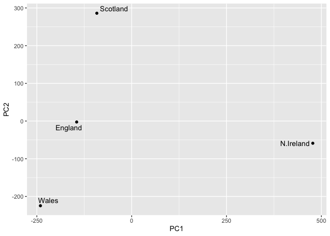

# class07
Cienna Santos (PID: A17581026)

- [Clustering](#clustering)
  - [K-means](#k-means)
  - [Hierarchical Clustering](#hierarchical-clustering)
- [Principal Component Analysis
  (PCA)](#principal-component-analysis-pca)
  - [Data import](#data-import)
  - [PCA to the rescue](#pca-to-the-rescue)

Today we will explore unsupervised machine learning methods starting
with clustering and dimensionality reduction.

## Clustering

To start let’s make up some data to cluster where we know what the
answer should be. The `rnorm()` function will help up here.

``` r
hist(rnorm(10000, mean=3))
```



Return 30 numbers centered on -3

``` r
tmp <- c( rnorm(30, mean=-3),
          rnorm(30, mean=3))

x <- cbind(x=tmp, y=rev(tmp))

x
```

                    x           y
     [1,] -2.85280135  3.21754089
     [2,] -3.61254421  3.65010873
     [3,] -2.24052757  2.54952417
     [4,] -0.50967475  3.39072383
     [5,] -2.61122738  3.01169871
     [6,] -2.53789085  4.26569261
     [7,] -2.36686945  3.82345053
     [8,] -2.47323891  3.29435350
     [9,] -2.98471081  1.67112028
    [10,] -0.12475071  3.04190421
    [11,] -3.00473065  2.59825661
    [12,] -3.48998101  4.14086677
    [13,] -4.90798225  3.23356677
    [14,] -4.17146089  0.54296814
    [15,] -3.36295361  3.98892406
    [16,] -2.91816617  2.40054623
    [17,] -2.78166826  1.84348815
    [18,] -3.23621010  2.04073828
    [19,] -1.87975267  4.86838609
    [20,] -0.03837586  2.39298759
    [21,] -3.15126085  5.61606746
    [22,] -3.81763600  3.12830526
    [23,] -4.24971527  3.93739941
    [24,] -3.45333616  2.27214148
    [25,] -2.89931847  2.85897704
    [26,] -3.57495540  3.99283339
    [27,] -3.85550004  2.65925955
    [28,] -4.47500577  3.22825082
    [29,] -2.49044798  2.24870002
    [30,] -2.70901287  3.45160916
    [31,]  3.45160916 -2.70901287
    [32,]  2.24870002 -2.49044798
    [33,]  3.22825082 -4.47500577
    [34,]  2.65925955 -3.85550004
    [35,]  3.99283339 -3.57495540
    [36,]  2.85897704 -2.89931847
    [37,]  2.27214148 -3.45333616
    [38,]  3.93739941 -4.24971527
    [39,]  3.12830526 -3.81763600
    [40,]  5.61606746 -3.15126085
    [41,]  2.39298759 -0.03837586
    [42,]  4.86838609 -1.87975267
    [43,]  2.04073828 -3.23621010
    [44,]  1.84348815 -2.78166826
    [45,]  2.40054623 -2.91816617
    [46,]  3.98892406 -3.36295361
    [47,]  0.54296814 -4.17146089
    [48,]  3.23356677 -4.90798225
    [49,]  4.14086677 -3.48998101
    [50,]  2.59825661 -3.00473065
    [51,]  3.04190421 -0.12475071
    [52,]  1.67112028 -2.98471081
    [53,]  3.29435350 -2.47323891
    [54,]  3.82345053 -2.36686945
    [55,]  4.26569261 -2.53789085
    [56,]  3.01169871 -2.61122738
    [57,]  3.39072383 -0.50967475
    [58,]  2.54952417 -2.24052757
    [59,]  3.65010873 -3.61254421
    [60,]  3.21754089 -2.85280135

Make a plot of `x`

``` r
plot(x)
```



### K-means

The main function in “base” R for K-means clustering is called
`kmeans()`:

``` r
km <- kmeans(x, centers =2)
km
```

    K-means clustering with 2 clusters of sizes 30, 30

    Cluster means:
              x         y
    1 -2.892724  3.112013
    2  3.112013 -2.892724

    Clustering vector:
     [1] 1 1 1 1 1 1 1 1 1 1 1 1 1 1 1 1 1 1 1 1 1 1 1 1 1 1 1 1 1 1 2 2 2 2 2 2 2 2
    [39] 2 2 2 2 2 2 2 2 2 2 2 2 2 2 2 2 2 2 2 2 2 2

    Within cluster sum of squares by cluster:
    [1] 67.51613 67.51613
     (between_SS / total_SS =  88.9 %)

    Available components:

    [1] "cluster"      "centers"      "totss"        "withinss"     "tot.withinss"
    [6] "betweenss"    "size"         "iter"         "ifault"      

The `kmeans()` function returns a “list with 9 components. You can see
the named components of any list with the `attributes()` function.

``` r
attributes(km)
```

    $names
    [1] "cluster"      "centers"      "totss"        "withinss"     "tot.withinss"
    [6] "betweenss"    "size"         "iter"         "ifault"      

    $class
    [1] "kmeans"

> Q. How many points are in each cluster?

``` r
km$size
```

    [1] 30 30

> Q. Cluster assignment/membership vector?

``` r
km$cluster
```

     [1] 1 1 1 1 1 1 1 1 1 1 1 1 1 1 1 1 1 1 1 1 1 1 1 1 1 1 1 1 1 1 2 2 2 2 2 2 2 2
    [39] 2 2 2 2 2 2 2 2 2 2 2 2 2 2 2 2 2 2 2 2 2 2

> Q. Cluster centers?

``` r
km$centers
```

              x         y
    1 -2.892724  3.112013
    2  3.112013 -2.892724

> Q. Make a plot of our `kmeans()` results showing cluster assignment
> using different colors for each cluster/group of points and cluster
> centers in blue.

``` r
plot(x, col=km$cluster)
points(km$centers, col="blue", pch=15, cex=2)
```



> Q. Run `kmeans()` again on `x` and this cluster into 4 groups/clusters
> and plot the same result figure as above.

``` r
km4 <- kmeans(x, centers=4)
plot(x, col=km4$cluster)
points(km4$centers, col="blue", pch=15, cex=2)
```



> **key-point**: K-means clustering is super populat but can be misused.
> One big limitation is that it can impose a clustering pattern on your
> data even if clear natural grouping doesn’t exist – i.e. it does what
> you tell it to do in terms of `centers`.

### Hierarchical Clustering

The main function in “base” R for hierarchical clustering is called
`hclust()`.

You can’t just pass our dataset as is into `hclust()`. You must give
“distance matrix” as input. We can get this from the `dist()` function
in R.

``` r
d <- dist(x)
hc <- hclust(d)
hc
```


    Call:
    hclust(d = d)

    Cluster method   : complete 
    Distance         : euclidean 
    Number of objects: 60 

The results of `hclust()` don’t have a useful `print()` method but do
have a special `plot()` method.

``` r
plot(hc)
abline(h=8, col = "red")
```



To get our main cluster assignment (membership vector), we need to “cut”
the tree at the big goal posts…

``` r
grps <- cutree(hc, h=8)
grps
```

     [1] 1 1 1 1 1 1 1 1 1 1 1 1 1 1 1 1 1 1 1 1 1 1 1 1 1 1 1 1 1 1 2 2 2 2 2 2 2 2
    [39] 2 2 2 2 2 2 2 2 2 2 2 2 2 2 2 2 2 2 2 2 2 2

``` r
table(grps)
```

    grps
     1  2 
    30 30 

``` r
plot(x, col=grps)
```



Hierarchical clustering is distinct in that the dendrogram (tree figure)
can reveal the potential grouping in your data (unlike K-means)

## Principal Component Analysis (PCA)

PCA is a common and highly useful dimensionality reduction technique
used in many fields - particularly bioinformatics.

Here we will analyze some data from the UK on food consumption.

### Data import

``` r
url <- "https://tinyurl.com/UK-foods"
x <- read.csv(url)

head(x)
```

                   X England Wales Scotland N.Ireland
    1         Cheese     105   103      103        66
    2  Carcass_meat      245   227      242       267
    3    Other_meat      685   803      750       586
    4           Fish     147   160      122        93
    5 Fats_and_oils      193   235      184       209
    6         Sugars     156   175      147       139

``` r
rownames(x) <- (x[,1])
x <- x[,-1]
head(x)
```

                   England Wales Scotland N.Ireland
    Cheese             105   103      103        66
    Carcass_meat       245   227      242       267
    Other_meat         685   803      750       586
    Fish               147   160      122        93
    Fats_and_oils      193   235      184       209
    Sugars             156   175      147       139

Reassigning x like this keeps erasing the columns as you re-run head()
over and over. Instead…

``` r
x <- (read.csv(url, row.names = 1))
head(x)
```

                   England Wales Scotland N.Ireland
    Cheese             105   103      103        66
    Carcass_meat       245   227      242       267
    Other_meat         685   803      750       586
    Fish               147   160      122        93
    Fats_and_oils      193   235      184       209
    Sugars             156   175      147       139

``` r
barplot(as.matrix(x), beside=T, col=rainbow(nrow(x)))
```


``` r
barplot(as.matrix(x), beside=F, col=rainbow(nrow(x)))
```


One conventional plot that can be useful is called a “paris” plot.

``` r
pairs(x, col=rainbow(nrow(x)), pch=16)
```


Follow which block borders each graph. That shows which two places are
being compared and on what axis.

### PCA to the rescue

The main function in base R for PCA is called `prcomp()`.

``` r
pca <- prcomp(t(x))
summary(pca)
```

    Importance of components:
                                PC1      PC2      PC3       PC4
    Standard deviation     324.1502 212.7478 73.87622 3.176e-14
    Proportion of Variance   0.6744   0.2905  0.03503 0.000e+00
    Cumulative Proportion    0.6744   0.9650  1.00000 1.000e+00

Proportion of Variance at PC1 means you could capture all 17 points in
one axis and you’d have 67% of the data there.

Cumulative Proportion on PC2 combines PC1 and PC2 Proportion of
Variance. It means you can plot those two together(? on different
axes??). and you’d capture 96% of the data.

The `prcomp()` function returns a list object of our results with five
attributes/components

``` r
attributes(pca)
```

    $names
    [1] "sdev"     "rotation" "center"   "scale"    "x"       

    $class
    [1] "prcomp"

The two main “results” in here are `pca$x` and `pca$rotation`. The first
of these (`pca$x`) contains the scores of the data on the new PC axis -
we use these to make our “PCA plot”.

``` r
pca$x
```

                     PC1         PC2        PC3           PC4
    England   -144.99315   -2.532999 105.768945 -4.894696e-14
    Wales     -240.52915 -224.646925 -56.475555  5.700024e-13
    Scotland   -91.86934  286.081786 -44.415495 -7.460785e-13
    N.Ireland  477.39164  -58.901862  -4.877895  2.321303e-13

``` r
library(ggplot2)
library(ggrepel)

# Make a plot of pca$x with PC1 vs PC2
ggplot(pca$x) +
  aes(PC1, PC2, label=rownames(pca$x)) +
  geom_point() +
  geom_text_repel()
```



This graph factors in all 17 point of each cluster and combines them
into 4 points. By plotting PC1 vs PC2 we get points on a graph that show
how similar/dissimilar the data of each cluster was from one another.

The second major result is contained in the `pca$rotation` object or
component. Let’s plot this to see what PCA is picking up…

``` r
ggplot(pca$rotation) +
  aes(PC1, rownames(pca$rotation)) +
  geom_col()
```


In this graph, any bar going in the positive direction shows that N.
Ireland eats more of those, and bars going in the negative direction
show that England, Scotland, and Wales eat more of that. The negative
and positive skew can be seen in the x-axis of the previous graph.
