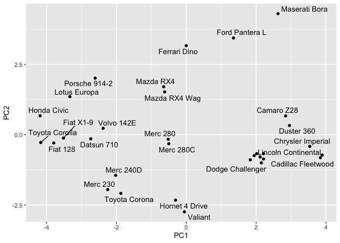
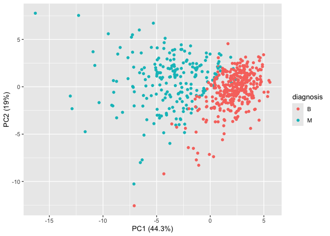

# Class 8: Breast cancer mini project
Cienna Santos (PID: A17581026)

## Background

This mini-project explores unsupervised learning techniques applied to
the Wisconsin Breast Cancer Diagnostic Data Set, which contains
measurements of human breast mass cell nuclei. The project guides the
user through exploratory data analysis, performing and interpreting
Principal Component Analysis (PCA) to reduce the dimensionality of the
data while retaining variance, and applying hierarchical clustering with
different linkage methods. It also includes an optional section on
K-means clustering for comparison. The ultimate goal is to combine PCA
and clustering to better separate benign and malignant cell samples,
evaluating the results using metrics like sensitivity and specificity,
and finally demonstrating how to predict the classification of new
samples using the developed PCA model.

## Data import

Our data comes from the U. of Wisconsin Medical Center.

``` r
wisc.df <- read.csv("WisconsinCancer.csv", row.names=1)
```

> Q1. How many patients/samples are in this dataset?

``` r
nrow(wisc.df)
```

    [1] 569

> Q2. How many of the observations have a malignant diagnosis?

``` r
wisc.df$diagnosis
```

      [1] "M" "M" "M" "M" "M" "M" "M" "M" "M" "M" "M" "M" "M" "M" "M" "M" "M" "M"
     [19] "M" "B" "B" "B" "M" "M" "M" "M" "M" "M" "M" "M" "M" "M" "M" "M" "M" "M"
     [37] "M" "B" "M" "M" "M" "M" "M" "M" "M" "M" "B" "M" "B" "B" "B" "B" "B" "M"
     [55] "M" "B" "M" "M" "B" "B" "B" "B" "M" "B" "M" "M" "B" "B" "B" "B" "M" "B"
     [73] "M" "M" "B" "M" "B" "M" "M" "B" "B" "B" "M" "M" "B" "M" "M" "M" "B" "B"
     [91] "B" "M" "B" "B" "M" "M" "B" "B" "B" "M" "M" "B" "B" "B" "B" "M" "B" "B"
    [109] "M" "B" "B" "B" "B" "B" "B" "B" "B" "M" "M" "M" "B" "M" "M" "B" "B" "B"
    [127] "M" "M" "B" "M" "B" "M" "M" "B" "M" "M" "B" "B" "M" "B" "B" "M" "B" "B"
    [145] "B" "B" "M" "B" "B" "B" "B" "B" "B" "B" "B" "B" "M" "B" "B" "B" "B" "M"
    [163] "M" "B" "M" "B" "B" "M" "M" "B" "B" "M" "M" "B" "B" "B" "B" "M" "B" "B"
    [181] "M" "M" "M" "B" "M" "B" "M" "B" "B" "B" "M" "B" "B" "M" "M" "B" "M" "M"
    [199] "M" "M" "B" "M" "M" "M" "B" "M" "B" "M" "B" "B" "M" "B" "M" "M" "M" "M"
    [217] "B" "B" "M" "M" "B" "B" "B" "M" "B" "B" "B" "B" "B" "M" "M" "B" "B" "M"
    [235] "B" "B" "M" "M" "B" "M" "B" "B" "B" "B" "M" "B" "B" "B" "B" "B" "M" "B"
    [253] "M" "M" "M" "M" "M" "M" "M" "M" "M" "M" "M" "M" "M" "M" "B" "B" "B" "B"
    [271] "B" "B" "M" "B" "M" "B" "B" "M" "B" "B" "M" "B" "M" "M" "B" "B" "B" "B"
    [289] "B" "B" "B" "B" "B" "B" "B" "B" "B" "M" "B" "B" "M" "B" "M" "B" "B" "B"
    [307] "B" "B" "B" "B" "B" "B" "B" "B" "B" "B" "B" "M" "B" "B" "B" "M" "B" "M"
    [325] "B" "B" "B" "B" "M" "M" "M" "B" "B" "B" "B" "M" "B" "M" "B" "M" "B" "B"
    [343] "B" "M" "B" "B" "B" "B" "B" "B" "B" "M" "M" "M" "B" "B" "B" "B" "B" "B"
    [361] "B" "B" "B" "B" "B" "M" "M" "B" "M" "M" "M" "B" "M" "M" "B" "B" "B" "B"
    [379] "B" "M" "B" "B" "B" "B" "B" "M" "B" "B" "B" "M" "B" "B" "M" "M" "B" "B"
    [397] "B" "B" "B" "B" "M" "B" "B" "B" "B" "B" "B" "B" "M" "B" "B" "B" "B" "B"
    [415] "M" "B" "B" "M" "B" "B" "B" "B" "B" "B" "B" "B" "B" "B" "B" "B" "M" "B"
    [433] "M" "M" "B" "M" "B" "B" "B" "B" "B" "M" "B" "B" "M" "B" "M" "B" "B" "M"
    [451] "B" "M" "B" "B" "B" "B" "B" "B" "B" "B" "M" "M" "B" "B" "B" "B" "B" "B"
    [469] "M" "B" "B" "B" "B" "B" "B" "B" "B" "B" "B" "M" "B" "B" "B" "B" "B" "B"
    [487] "B" "M" "B" "M" "B" "B" "M" "B" "B" "B" "B" "B" "M" "M" "B" "M" "B" "M"
    [505] "B" "B" "B" "B" "B" "M" "B" "B" "M" "B" "M" "B" "M" "M" "B" "B" "B" "M"
    [523] "B" "B" "B" "B" "B" "B" "B" "B" "B" "B" "B" "M" "B" "M" "M" "B" "B" "B"
    [541] "B" "B" "B" "B" "B" "B" "B" "B" "B" "B" "B" "B" "B" "B" "B" "B" "B" "B"
    [559] "B" "B" "B" "B" "M" "M" "M" "M" "M" "M" "B"

``` r
table(wisc.df$diagnosis)
```


      B   M 
    357 212 

``` r
sum(wisc.df$diagnosis == "M")
```

    [1] 212

> Q3. How many variables/features in the data are suffixed with \_mean?

``` r
colnames(wisc.df)
```

     [1] "diagnosis"               "radius_mean"            
     [3] "texture_mean"            "perimeter_mean"         
     [5] "area_mean"               "smoothness_mean"        
     [7] "compactness_mean"        "concavity_mean"         
     [9] "concave.points_mean"     "symmetry_mean"          
    [11] "fractal_dimension_mean"  "radius_se"              
    [13] "texture_se"              "perimeter_se"           
    [15] "area_se"                 "smoothness_se"          
    [17] "compactness_se"          "concavity_se"           
    [19] "concave.points_se"       "symmetry_se"            
    [21] "fractal_dimension_se"    "radius_worst"           
    [23] "texture_worst"           "perimeter_worst"        
    [25] "area_worst"              "smoothness_worst"       
    [27] "compactness_worst"       "concavity_worst"        
    [29] "concave.points_worst"    "symmetry_worst"         
    [31] "fractal_dimension_worst"

``` r
length(grep("_mean", colnames(wisc.df), value = T))
```

    [1] 10

There is a diagnosis column that is the clinician consensus that I want
to exclude from any further analysis. We will come back later and
compare our results to this diagnosis.

``` r
diagnosis <- as.factor(wisc.df$diagnosis)
head(diagnosis)
```

    [1] M M M M M M
    Levels: B M

Now we can remove it from the `wisc.df`

``` r
wisc.data <- wisc.df[,-1]
```

## Clustering

Let’s try a `hclust()`

``` r
hc <- hclust(dist(wisc.data))
plot(hc)
```


We can extract clusters from this rather poor dendrogram/tree with the
`cutree()`

``` r
grps <- cutree(hc, k=2)
```

How many individuals in each cluster?

``` r
table(grps)
```

    grps
      1   2 
    549  20 

``` r
table(diagnosis)
```

    diagnosis
      B   M 
    357 212 

We can generate a cross-table that compares our cluster `grps` vector
without `diagnosis` vector values.

``` r
table(diagnosis, grps)
```

             grps
    diagnosis   1   2
            B 357   0
            M 192  20

## Principal Component Analysis

### The importance of data scaling

The main function for PCA in base R is `prcomp()` it has a default input
parameter of `scale=FALSE`.

``` r
#prcomp()
head(mtcars)
```

                       mpg cyl disp  hp drat    wt  qsec vs am gear carb
    Mazda RX4         21.0   6  160 110 3.90 2.620 16.46  0  1    4    4
    Mazda RX4 Wag     21.0   6  160 110 3.90 2.875 17.02  0  1    4    4
    Datsun 710        22.8   4  108  93 3.85 2.320 18.61  1  1    4    1
    Hornet 4 Drive    21.4   6  258 110 3.08 3.215 19.44  1  0    3    1
    Hornet Sportabout 18.7   8  360 175 3.15 3.440 17.02  0  0    3    2
    Valiant           18.1   6  225 105 2.76 3.460 20.22  1  0    3    1

We could do a PCA of this data as is and it could be mis-leading…

``` r
pc <- prcomp(mtcars)
biplot(pc)
```


Let’s look at the mean values of each column and their standard
deviation.

``` r
colMeans(mtcars)
```

           mpg        cyl       disp         hp       drat         wt       qsec 
     20.090625   6.187500 230.721875 146.687500   3.596563   3.217250  17.848750 
            vs         am       gear       carb 
      0.437500   0.406250   3.687500   2.812500 

``` r
apply(mtcars, 2, sd)
```

            mpg         cyl        disp          hp        drat          wt 
      6.0269481   1.7859216 123.9386938  68.5628685   0.5346787   0.9784574 
           qsec          vs          am        gear        carb 
      1.7869432   0.5040161   0.4989909   0.7378041   1.6152000 

We can “scale” this data before PCA to get a much better representation
and analysis of all the columns.

``` r
mtscale <- scale(mtcars)
```

``` r
round(colMeans(mtscale))
```

     mpg  cyl disp   hp drat   wt qsec   vs   am gear carb 
       0    0    0    0    0    0    0    0    0    0    0 

``` r
apply(mtscale, 2, sd)
```

     mpg  cyl disp   hp drat   wt qsec   vs   am gear carb 
       1    1    1    1    1    1    1    1    1    1    1 

``` r
pc.scale <- prcomp(mtscale)
```

We can look at the two main results figures from PCA - the “PC plot”
(a.k.a. score plot, ordination plot, or PC1 vs PC2 plot). The “loadings
plot” how the original variables contribute to the new PCs

A loadings plot of the unscaled PCA results

``` r
library(ggplot2)

ggplot(pc$rotation) +
  aes(PC1, rownames(pc$rotation)) +
  geom_col()
```


Loadings plot of the scaled data.

``` r
ggplot(pc.scale$rotation) +
  aes(PC1, rownames(pc$rotation)) +
  geom_col()
```


PC plot of scaled PCA results

``` r
library(ggrepel)

ggplot(pc.scale$x) +
  aes(PC1, PC2, label=rownames(pc.scale$x)) +
  geom_point() +
  geom_text_repel()
```

    Warning: ggrepel: 6 unlabeled data points (too many overlaps). Consider
    increasing max.overlaps



> **Key point**: In general we will set `scale=TRUE` when we do PCA.
> This is not the default but probably should be…

We can check the SD and mean of the different columns in `wisc.data` to
see if we need to scale - hint: we do!

### PCA of wisc.data

``` r
wisc.pr <- prcomp(wisc.data, scale=TRUE)
```

To see how well PCA is doing here in terms of capturing the variance (or
spread) in the data we can use the `summary()` function.

``` r
summary(wisc.pr)
```

    Importance of components:
                              PC1    PC2     PC3     PC4     PC5     PC6     PC7
    Standard deviation     3.6444 2.3857 1.67867 1.40735 1.28403 1.09880 0.82172
    Proportion of Variance 0.4427 0.1897 0.09393 0.06602 0.05496 0.04025 0.02251
    Cumulative Proportion  0.4427 0.6324 0.72636 0.79239 0.84734 0.88759 0.91010
                               PC8    PC9    PC10   PC11    PC12    PC13    PC14
    Standard deviation     0.69037 0.6457 0.59219 0.5421 0.51104 0.49128 0.39624
    Proportion of Variance 0.01589 0.0139 0.01169 0.0098 0.00871 0.00805 0.00523
    Cumulative Proportion  0.92598 0.9399 0.95157 0.9614 0.97007 0.97812 0.98335
                              PC15    PC16    PC17    PC18    PC19    PC20   PC21
    Standard deviation     0.30681 0.28260 0.24372 0.22939 0.22244 0.17652 0.1731
    Proportion of Variance 0.00314 0.00266 0.00198 0.00175 0.00165 0.00104 0.0010
    Cumulative Proportion  0.98649 0.98915 0.99113 0.99288 0.99453 0.99557 0.9966
                              PC22    PC23   PC24    PC25    PC26    PC27    PC28
    Standard deviation     0.16565 0.15602 0.1344 0.12442 0.09043 0.08307 0.03987
    Proportion of Variance 0.00091 0.00081 0.0006 0.00052 0.00027 0.00023 0.00005
    Cumulative Proportion  0.99749 0.99830 0.9989 0.99942 0.99969 0.99992 0.99997
                              PC29    PC30
    Standard deviation     0.02736 0.01153
    Proportion of Variance 0.00002 0.00000
    Cumulative Proportion  1.00000 1.00000

Let’s make the main PC1 vs PC2

``` r
ggplot(wisc.pr$x) +
  aes(PC1, PC2, col=diagnosis) +
  geom_point() +
  xlab("PC1 (44.3%)") +
  ylab("PC2 (19%)")
```



> Q4. From your results, what proportion of the original variance is
> captured by the first principal components (PC1)?

44.3% of the original variance is captured by PC1.

> Q5. How many principal components (PCs) are required to describe at
> least 70% of the original variance in the data?

In this case, the first 3 PCs are required.

> Q6. How many principal components (PCs) are required to describe at
> least 90% of the original variance in the data?

The first 7 PCs are required here.

We’ll create a biplot of the wisc.pr using the biplot() function.

``` r
biplot(wisc.pr)
```


> Q7. What stands out to you about this plot? Is it easy or difficult to
> understand? Why?

There are so many points clustered around such a large area in the
middle, making the plot difficult to understand. Most black labels are
so stacked they’re unreadable and the red labels are numerous too.

We’ll generate a more standard scatter plot of each observation along
principal components 1 and 2 (available as the first two columns of
wisc.pr\$x) and color the points by the diagnosis.

``` r
plot(wisc.pr$x[,1:2], col = diagnosis, xlab = "PC1", ylab = "PC2")
```


> Q8. Generate a similar plot for principal components 1 and 3. What do
> you notice about these plots?

``` r
plot(wisc.pr$x[,c(1,3)], col = diagnosis, xlab = "PC1", ylab = "PC3")
```


Since the points are colored by diagnosis we can easily see how they
generally group together in separate clusters, usually red on the left
and black on the right. The different diagnoses also seem to overlap a
bit more in the PC1 vs PC3 graph.

> Q9. For the first principal component, what is the component of the
> loading vector (i.e. wisc.pr\$rotation\[,1\]) for the feature
> concave.points_mean?

``` r
wisc.pr$rotation[,1]
```

                radius_mean            texture_mean          perimeter_mean 
                -0.21890244             -0.10372458             -0.22753729 
                  area_mean         smoothness_mean        compactness_mean 
                -0.22099499             -0.14258969             -0.23928535 
             concavity_mean     concave.points_mean           symmetry_mean 
                -0.25840048             -0.26085376             -0.13816696 
     fractal_dimension_mean               radius_se              texture_se 
                -0.06436335             -0.20597878             -0.01742803 
               perimeter_se                 area_se           smoothness_se 
                -0.21132592             -0.20286964             -0.01453145 
             compactness_se            concavity_se       concave.points_se 
                -0.17039345             -0.15358979             -0.18341740 
                symmetry_se    fractal_dimension_se            radius_worst 
                -0.04249842             -0.10256832             -0.22799663 
              texture_worst         perimeter_worst              area_worst 
                -0.10446933             -0.23663968             -0.22487053 
           smoothness_worst       compactness_worst         concavity_worst 
                -0.12795256             -0.21009588             -0.22876753 
       concave.points_worst          symmetry_worst fractal_dimension_worst 
                -0.25088597             -0.12290456             -0.13178394 

It’s -0.26085376.

> Q10. What is the minimum number of principal components required to
> explain 80% of the variance of the data?

It’s the first 5 PCs.

## 5. Combining methods

We can take our PCA results and use them as a basis set for other
analysis such as clustering.

### Clustering on PCA results

``` r
wisc.pr.hclust <- hclust(dist(wisc.pr$x[,1:2]), method="ward.D2")
plot(wisc.pr.hclust)
```


We can “cut” this tree to yield our clusters (groups):

``` r
pc.grps <- cutree(wisc.pr.hclust, k=2)
table(pc.grps)
```

    pc.grps
      1   2 
    195 374 

How do my cluster grps compare to the expert diagnosis

``` r
table(diagnosis, pc.grps)
```

             pc.grps
    diagnosis   1   2
            B  18 339
            M 177  35

The smaller numbers of benign and malignant points in the other column
show the overlap of clusters, and can indicate some results of false
negatives or positives.

``` r
table(diagnosis)
```

    diagnosis
      B   M 
    357 212 

> Q.15 How well does the newly created model with four clusters separate
> out the two diagnoses?

It seems to separate them well, still showing the majority of the points
in the two groups but even accounting for overlap meaning possible false
positives or false negatives.

> Q.16 How well do the hierarchical clustering models you created in
> previous sections (i.e. before PCA) do in terms of separating the
> diagnoses?

They did really badly. We did so much better after PCA - the new PCA
variable (what we call a basis set) give us much better separation of M
and B.

``` r
table(diagnosis, grps)
```

             grps
    diagnosis   1   2
            B 357   0
            M 192  20

``` r
table(diagnosis, pc.grps)
```

             pc.grps
    diagnosis   1   2
            B  18 339
            M 177  35

Sensitivity refers to a test’s ability to correctly detect ill patients
who do have the condition. In our example here the sensitivity is the
total number of samples in the cluster identified as predominantly
malignant (cancerous) divided by the total number of known malignant
samples. In other words: TP/(TP+FN).

Specificity relates to a test’s ability to correctly reject healthy
patients without a condition. In our example specificity is the
proportion of benign (not cancerous) samples in the cluster identified
as predominantly benign that are known to be benign. In other words:
TN/(TN+FN).

> Q17. Which of your analysis procedures resulted in a clustering model
> with the best specificity? How about sensitivity?

Using cutree() on hclust to get pc.grps seemed to result in the best
specificity and sensitivity compared to grps.

## 7. Prediction

We can use our PCA model for the analysis of new “unseen” data. In this
case from U. Mich.

``` r
url <- "https://tinyurl.com/new-samples-CSV"
new <- read.csv(url)
npc <- predict(wisc.pr, newdata=new)
npc
```

               PC1       PC2        PC3        PC4       PC5        PC6        PC7
    [1,]  2.576616 -3.135913  1.3990492 -0.7631950  2.781648 -0.8150185 -0.3959098
    [2,] -4.754928 -3.009033 -0.1660946 -0.6052952 -1.140698 -1.2189945  0.8193031
                PC8       PC9       PC10      PC11      PC12      PC13     PC14
    [1,] -0.2307350 0.1029569 -0.9272861 0.3411457  0.375921 0.1610764 1.187882
    [2,] -0.3307423 0.5281896 -0.4855301 0.7173233 -1.185917 0.5893856 0.303029
              PC15       PC16        PC17        PC18        PC19       PC20
    [1,] 0.3216974 -0.1743616 -0.07875393 -0.11207028 -0.08802955 -0.2495216
    [2,] 0.1299153  0.1448061 -0.40509706  0.06565549  0.25591230 -0.4289500
               PC21       PC22       PC23       PC24        PC25         PC26
    [1,]  0.1228233 0.09358453 0.08347651  0.1223396  0.02124121  0.078884581
    [2,] -0.1224776 0.01732146 0.06316631 -0.2338618 -0.20755948 -0.009833238
                 PC27        PC28         PC29         PC30
    [1,]  0.220199544 -0.02946023 -0.015620933  0.005269029
    [2,] -0.001134152  0.09638361  0.002795349 -0.019015820

``` r
plot(wisc.pr$x[,1:2], col=diagnosis)
points(npc[,1], npc[,2], col="blue", pch=16, cex=3)
text(npc[,1], npc[,2], c(1,2), col="white")
```


> Q.18. Which of these new patients should we prioritize for follow up
> based on your results?

We should prioritize the patients under 2, the red dots, for follow up.
