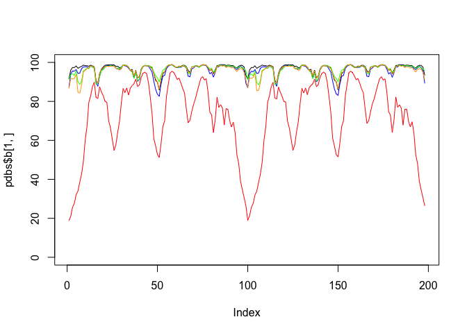
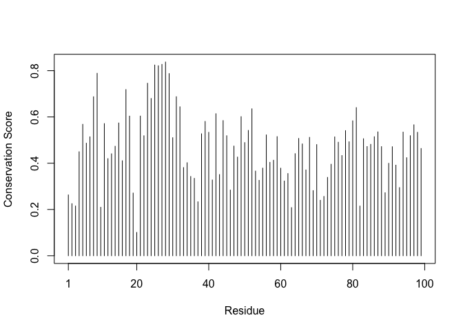
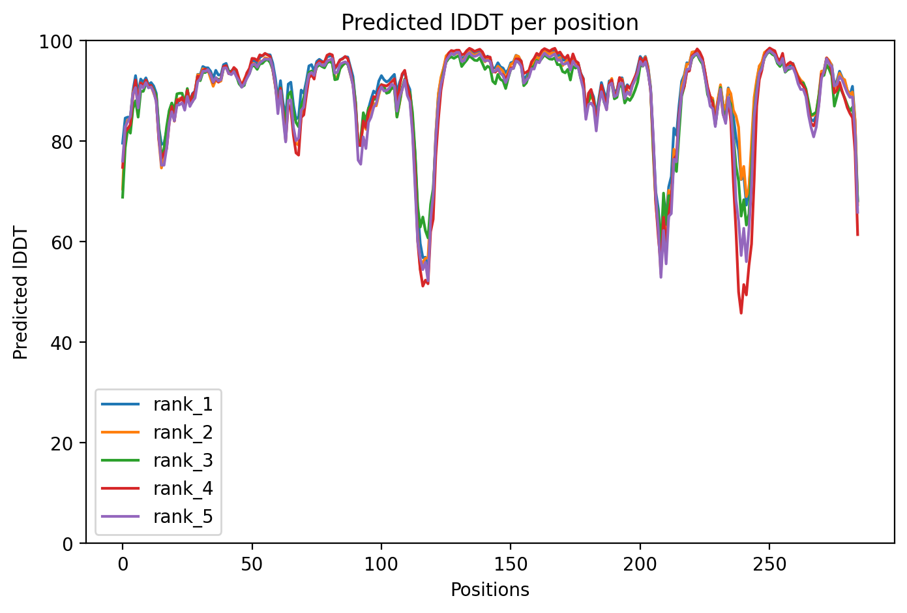

# Class 11: Protein Structure Prediction with AlphaFold
Cienna Santos (PID: A17581026)

Here we read the results from AlphaFold and try to interpret all the
models and quality score metrics:

``` r
library(bio3d)

pth <- "hivdimer_23119/"
pdb.files <- list.files(path = pth, full.names = TRUE, pattern = ".pdb")
```

Align and superpose all these models

``` r
file.exists(pdb.files)
```

    [1] TRUE TRUE TRUE TRUE TRUE

``` r
pdbs <- pdbaln(pdb.files, fit = TRUE, exefile="msa")
```

    Reading PDB files:
    hivdimer_23119//hivdimer_23119_unrelaxed_rank_001_alphafold2_multimer_v3_model_2_seed_000.pdb
    hivdimer_23119//hivdimer_23119_unrelaxed_rank_002_alphafold2_multimer_v3_model_5_seed_000.pdb
    hivdimer_23119//hivdimer_23119_unrelaxed_rank_003_alphafold2_multimer_v3_model_4_seed_000.pdb
    hivdimer_23119//hivdimer_23119_unrelaxed_rank_004_alphafold2_multimer_v3_model_1_seed_000.pdb
    hivdimer_23119//hivdimer_23119_unrelaxed_rank_005_alphafold2_multimer_v3_model_3_seed_000.pdb
    .....

    Extracting sequences

    pdb/seq: 1   name: hivdimer_23119//hivdimer_23119_unrelaxed_rank_001_alphafold2_multimer_v3_model_2_seed_000.pdb 
    pdb/seq: 2   name: hivdimer_23119//hivdimer_23119_unrelaxed_rank_002_alphafold2_multimer_v3_model_5_seed_000.pdb 
    pdb/seq: 3   name: hivdimer_23119//hivdimer_23119_unrelaxed_rank_003_alphafold2_multimer_v3_model_4_seed_000.pdb 
    pdb/seq: 4   name: hivdimer_23119//hivdimer_23119_unrelaxed_rank_004_alphafold2_multimer_v3_model_1_seed_000.pdb 
    pdb/seq: 5   name: hivdimer_23119//hivdimer_23119_unrelaxed_rank_005_alphafold2_multimer_v3_model_3_seed_000.pdb 

``` r
library(bio3dview)
#view.pdbs(pdbs)
```

``` r
plot(pdbs$b[1,], typ="l", ylim=c(0,100))
lines(pdbs$b[2,], typ="l", col="blue")
lines(pdbs$b[3,], typ="l", col="green")
lines(pdbs$b[4,], typ="l", col="orange")
lines(pdbs$b[5,], typ="l", col="red")
```



# Predicted Alignment Error for domains

``` r
library(jsonlite)

# Listing of all PAE JSON files
pae_files <- list.files(path=pth,
                        pattern=".*model.*\\.json",
                        full.names = TRUE)
```

``` r
pae1 <- read_json(pae_files[1],simplifyVector = TRUE)
pae5 <- read_json(pae_files[5],simplifyVector = TRUE)

attributes(pae1)
```

    $names
    [1] "plddt"   "max_pae" "pae"     "ptm"     "iptm"   

``` r
# Per-residue pLDDT scores 
#  same as B-factor of PDB..
head(pae1$plddt) 
```

    [1] 91.44 96.06 97.38 97.38 98.19 96.94

``` r
pae1$max_pae
```

    [1] 13.57812

``` r
pae5$max_pae
```

    [1] 29.85938

``` r
plot.dmat(pae1$pae, 
          xlab="Residue Position (i)",
          ylab="Residue Position (j)")
```


``` r
plot.dmat(pae5$pae, 
          xlab="Residue Position (i)",
          ylab="Residue Position (j)",
          grid.col = "black",
          zlim=c(0,30))
```


We should really plot all of these using the same z range. Here is the
model 1 plot again but this time using the same data range as the plot
for model 5:

``` r
plot.dmat(pae1$pae, 
          xlab="Residue Position (i)",
          ylab="Residue Position (j)",
          grid.col = "black",
          zlim=c(0,30))
```


# Score Residue Conservation from alignment file

AlphaFold returns its large alignment file used for analysis Here we
read this file and score conservation per position

``` r
aln_file <- list.files(path=pth,
                       pattern=".a3m$",
                        full.names = TRUE)
aln_file
```

    [1] "hivdimer_23119//hivdimer_23119.a3m"

``` r
aln <- read.fasta(aln_file[1], to.upper = TRUE)
```

    [1] " ** Duplicated sequence id's: 101 **"
    [2] " ** Duplicated sequence id's: 101 **"

How many sequences are in this alignment

``` r
dim(aln$ali)
```

    [1] 5378  132

We can score residue conservation in the alignment with the conserv()
function.

``` r
sim <- conserv(aln)
```

``` r
plotb3(sim[1:99],
       ylab="Conservation Score")
```



Find the consensus sequence at a very high cut-off to find invariant
residues

``` r
con <- consensus(aln, cutoff = 0.9)
con$seq
```

      [1] "-" "-" "-" "-" "-" "-" "-" "-" "-" "-" "-" "-" "-" "-" "-" "-" "-" "-"
     [19] "-" "-" "-" "-" "-" "-" "D" "T" "G" "A" "-" "-" "-" "-" "-" "-" "-" "-"
     [37] "-" "-" "-" "-" "-" "-" "-" "-" "-" "-" "-" "-" "-" "-" "-" "-" "-" "-"
     [55] "-" "-" "-" "-" "-" "-" "-" "-" "-" "-" "-" "-" "-" "-" "-" "-" "-" "-"
     [73] "-" "-" "-" "-" "-" "-" "-" "-" "-" "-" "-" "-" "-" "-" "-" "-" "-" "-"
     [91] "-" "-" "-" "-" "-" "-" "-" "-" "-" "-" "-" "-" "-" "-" "-" "-" "-" "-"
    [109] "-" "-" "-" "-" "-" "-" "-" "-" "-" "-" "-" "-" "-" "-" "-" "-" "-" "-"
    [127] "-" "-" "-" "-" "-" "-"

``` r
rd <- rmsd(pdbs, fit=T)
```

    Warning in rmsd(pdbs, fit = T): No indices provided, using the 198 non NA positions

``` r
range(rd)
```

    [1]  0.000 13.406

Draw a heatmap of these RMSD matrix values

``` r
library(pheatmap)

colnames(rd) <- paste0("m",1:5)
rownames(rd) <- paste0("m",1:5)
pheatmap(rd)
```


# Alphafold results for my project sequence

``` r
library(bio3d)

ptht <- "test_50fcd/"
pdbt.files <- list.files(path = ptht, full.names = TRUE, pattern = ".pdb")
```

Align and superpose all these models

``` r
file.exists(pdbt.files)
```

    [1] TRUE TRUE TRUE TRUE TRUE

``` r
pdbst <- pdbaln(pdbt.files, fit = TRUE, exefile="msa")
```

    Reading PDB files:
    test_50fcd//test_50fcd_unrelaxed_rank_001_alphafold2_ptm_model_4_seed_000.pdb
    test_50fcd//test_50fcd_unrelaxed_rank_002_alphafold2_ptm_model_2_seed_000.pdb
    test_50fcd//test_50fcd_unrelaxed_rank_003_alphafold2_ptm_model_1_seed_000.pdb
    test_50fcd//test_50fcd_unrelaxed_rank_004_alphafold2_ptm_model_5_seed_000.pdb
    test_50fcd//test_50fcd_unrelaxed_rank_005_alphafold2_ptm_model_3_seed_000.pdb
    .....

    Extracting sequences

    pdb/seq: 1   name: test_50fcd//test_50fcd_unrelaxed_rank_001_alphafold2_ptm_model_4_seed_000.pdb 
    pdb/seq: 2   name: test_50fcd//test_50fcd_unrelaxed_rank_002_alphafold2_ptm_model_2_seed_000.pdb 
    pdb/seq: 3   name: test_50fcd//test_50fcd_unrelaxed_rank_003_alphafold2_ptm_model_1_seed_000.pdb 
    pdb/seq: 4   name: test_50fcd//test_50fcd_unrelaxed_rank_004_alphafold2_ptm_model_5_seed_000.pdb 
    pdb/seq: 5   name: test_50fcd//test_50fcd_unrelaxed_rank_005_alphafold2_ptm_model_3_seed_000.pdb 

``` r
library(bio3dview)
#view.pdbs(pdbst)
```



